# How to Create World Map Overrides

A tutorial by Alistu a.k.a. Menaceman44

This tutorial will show you how to create a package that will change what the Sims world looks like from the map screen. It will show you how to find the images you need, how to prepare them for editing, and how to package your edited images back into a .package file that will work with the game.

This tutorial will NOT teach you how to use your image editing software.

## You will need the following programs:

* [Sims 4 Image Viewer](https://luniversims.fr/files/file/649-visionneuse-dimage-pour-fichiers-packages/)
* [Sims4Studio](https://sims4studio.com/board/6/download-sims-studio-open-version)
* [UI Texture Squasher 1.2.0.0](https://modthesims.info/d/581475)
* Picture Editing Software - Anything that can work with PNGs and transparency.

For this tutorial I will be showing you how to make an override for the Willow Creek map. Let's begin.

## Finding and extracting the required images

### Step 1.

Launch **Sims 4 Image Viewer** and go to "File > Common Files > UI".

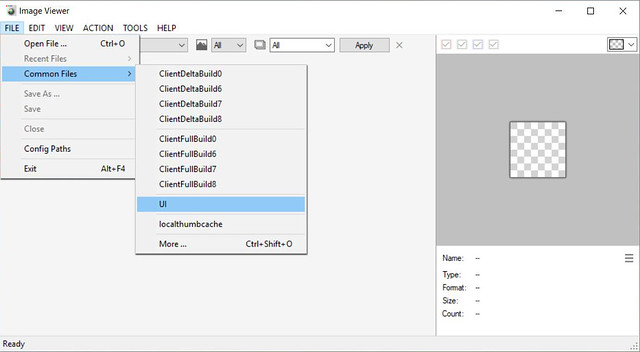

The window on the left should then become populated with all of the images that are available in the UI package.

### Step 2.

The maps in game are made up of two separate images that the game combines to create the full colour image. We need to find both of these to be able to edit the map correctly.

Scroll through the images on the left of the screen looking for one that matches the map you are wanting to edit, in this case Willow Creek. One of the required images will appear a murky green colour and the other, which should be situated next to the first, will be a bright green surrounded by black.

If you are unsure that you have the correct files, check the preview in the right-hand window. This shows the image you have selected and, below that, what the image looks like in game when combined with its partner image.

### Step 3. 

Right-click on the image resource you need and select "Extract".

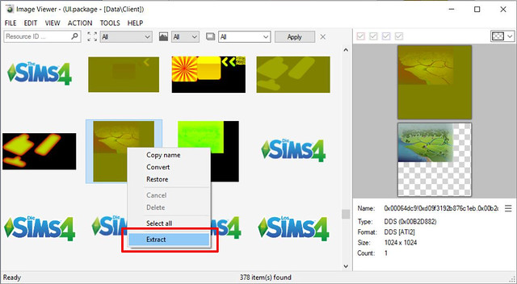

Leave the file name and file type as they are and save it to a location you can easily find later. We will need the information in the file name later on in the tutorial. I decided to make a project folder on my desktop. Repeat this step for the second image so that you have two DDS image files saved in the same location.

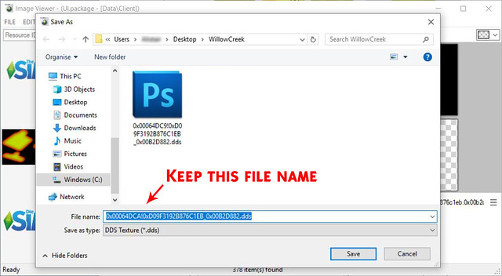

Now that we have both of the required images we can close **Sims 4 Image Viewer**.

## Preparing the images for editing

Before the map can be edited, the two separate images must first be combined into one file that will make sense and look familiar to us.

### Step 4.

Open **UI Texture Squasher**. 

The top two boxes are where we will enter the images we extracted previously. Take note of the group IDs on the left.

Press the "Select" button to choose your files and for each one, select the file that has a matching group ID at the start of the file name. So, the file that starts with 0x00064DCA goes in the top box, and the file that starts with 0x00064DC9 goes in the bottom box as shown.

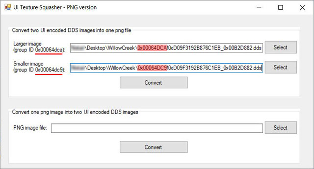

### Step 5.

Press the "Convert" button in the top half of the window and you will be prompted to save the new image file. You can name this file whatever you like. Leave the file type as it is. I have simply named it WillowCreek as that is that map we are editing.

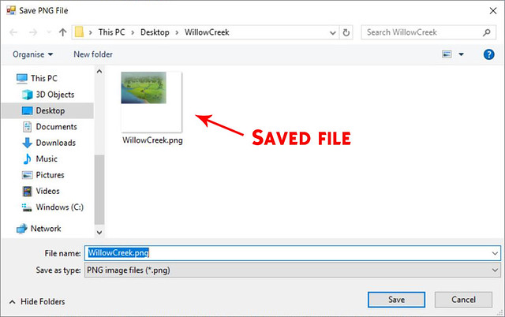

We can now close **UI Texture Squasher** as we are done with it for now. We will come back to it later in the tutorial.

## Editing your image

### Step 6.

You can now open the resulting image file in any image editing software of your choice so long as it is able to work with PNG files and transparency.

When editing the image, make sure not to change the image dimensions. If you do, the game may be unable to read the files when they are put into the game which may cause display issues.

It is also important to retain the blank sections of the image.

Once you have made your edits move onto the next step.

Here are my before and after maps. For the purpose of this tutorial I have simply inverted the colours.

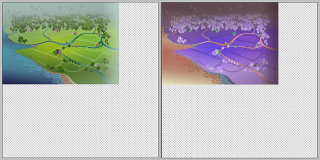

## Preparing your image for import

### Step 7.

Open **UI Texture Squasher** again. We now need to convert the edited image back into two separate images that the game can use.

This time use the "Select" button at the bottom of the screen and choose your edited PNG file. Now press the "Convert" button at the bottom and a new window will open where you will be prompted to save your files.

Keep the file name that you are given as well as the image type. Once you click "Save" a second window will open asking you to save the second image we need. Again, keep the file name and type that you are given and press "Save".

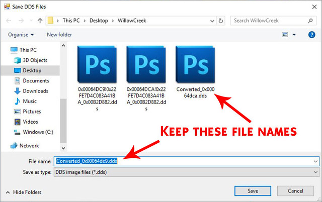

Done. We can now close **UI Texture Squasher**.

## Creating the package

### Step 8.

Open **Sims 4 Studio**. If this is the first time you have used Studio then you will need to enter your creator name in the text box in the lower right. This name should be unique to you. Next go to "Tools > Create Empty Package".

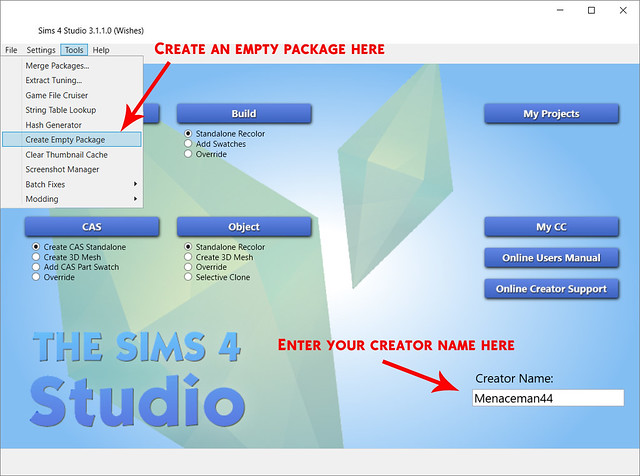

You will then be prompted to give your package a name and to choose a location to save it to. You can save it wherever you like but to keep things easy I'm going to save it into my project folder. I'm going to call mine "MMwillowCreekTutorialMap". Then press "Save".

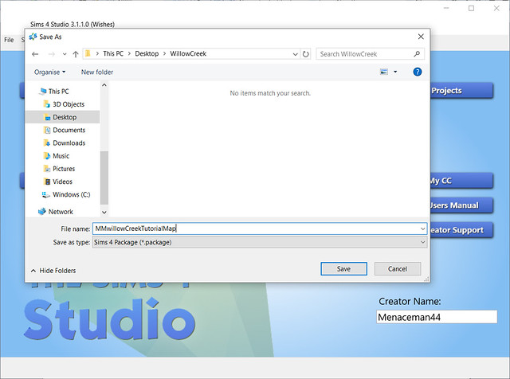

**Sims 4 Studio** will then load into the Warehouse view and the program will look pretty empty.

### Step 9.

Now we need to import our image files into the package so that the game will be able to make use of them. Click the "Add" button in the lower left corner of the screen. A new "Add Resource" window will then appear. Choose "DSTImageResource" from the "Type" dropdown box and then click the "OK" button in the "Add Resource" window.

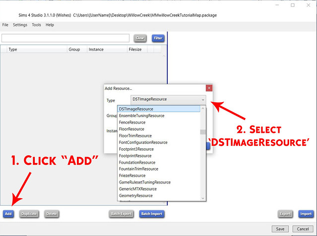

You should now see an entry for a DST Image resource appear on the left of the screen.

### Step 10.

Select the new DST Image resource and then select the "Data" tab on the right of the screen.

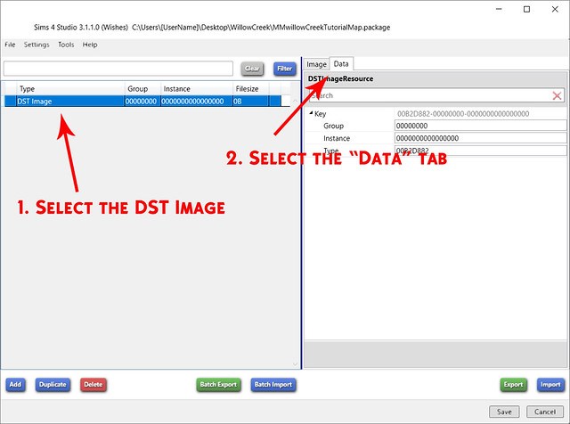

We are now going to enter the "Group" and "Instance" information. We find both of these values in the file names of the images that we originally exported with **Sims 4 Image Viewer** at the start of the tutorial.

I've imposed one of the file names into the image below to show where each value comes from. Ignore any "0x" parts or special characters of the file name when copying the values.

As you can see, the "Type" field was already filled in with the correct value when we selected "DSTImageResource".

### Step 11.

Click the "Add" button again and this time the "Add Resource" window should already be filled in for you. Both image resources share the same "Type" and "Instance" values but we need to change the last digit of the "Group" value from "9" to "A". Once you have done that, click "OK".

## Importing the images

### Step 12.

Select the first DST Image resource and then change back to the "Image" tab. Check which group number the selected DST Image resource has, in my case "00064DCA", and then click the "Import" button in the lower right of the screen.

In the window that appears, select the "Converted_" DDS image with the file name that matches the "Group" number of the selected resource. So I will select the Converted_0x00064DCA file. Then click "Open".

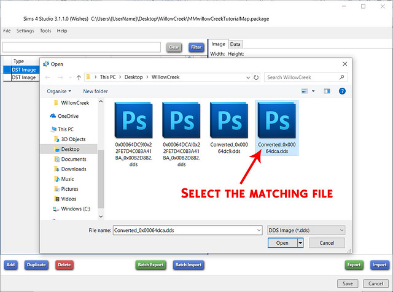

There should now be a large grey texture on the right side of the screen.

Select the other DST Image resource and repeat Step 12, this time importing the remaining converted DDS image instead.

### Step 13.

You should now have a large grey texture showing on the right side of the screen for both DST Image resources.

Click "Save" in the lower right of the screen. After a few seconds a window will pop up letting you know that the package has been saved successfully. Click "Okay".

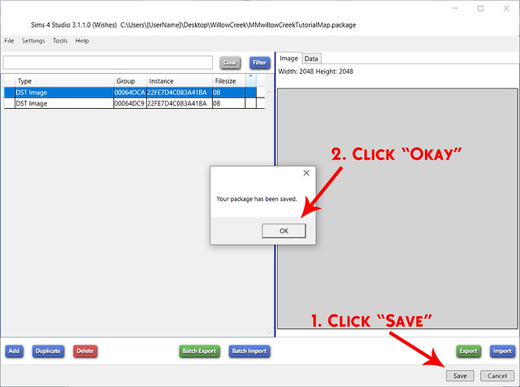

Your .package is now finished! You may close **Sims 4 Studio**.

## Testing the package in game

### Step 14.

Move your new package file into your mods folder, located at "Documents > Electronic Arts > The Sims 4 > Mods" on a typical installation, and start the game. Once the game has loaded, select the location that uses the map you have made your package for and observe your changes!

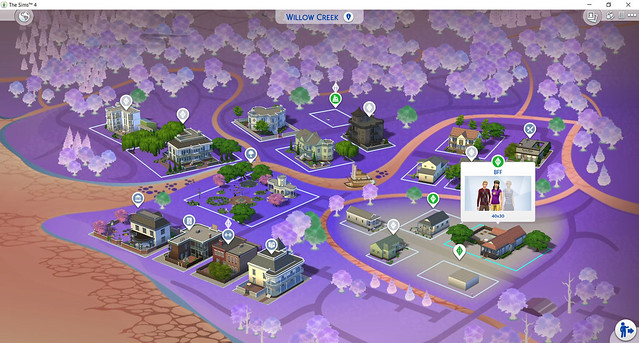

Congratulations on creating your first Sims 4 default map override!

## Things to note

If your map doesn't show up, first make sure that you have mods enabled in the game options and then restart the game.

This will only change the appearance of the map. The 3D world will look exactly the same as it did before.

This method does NOT enable you to change the location of the Lots. That information is stored elsewhere in the game files and is beyond the scope of this tutorial.

Tutorial written by Alistair Stuart a.k.a [Menaceman44](https://modthesims.info/member.php?u=59363) a.k.a. [Alistu](https://alistu.tumblr.com/). Please do not repost without permission.

---

Originally posted on the [Sims 4 Studio forum](https://sims4studio.com/thread/12602/tutorial-create-world-map-overrides). Downloadable copy [available here](https://onedrive.live.com/?cid=766D3134405E0A6F&id=766D3134405E0A6F%21855&parId=766D3134405E0A6F%21719&o=OneUp).
