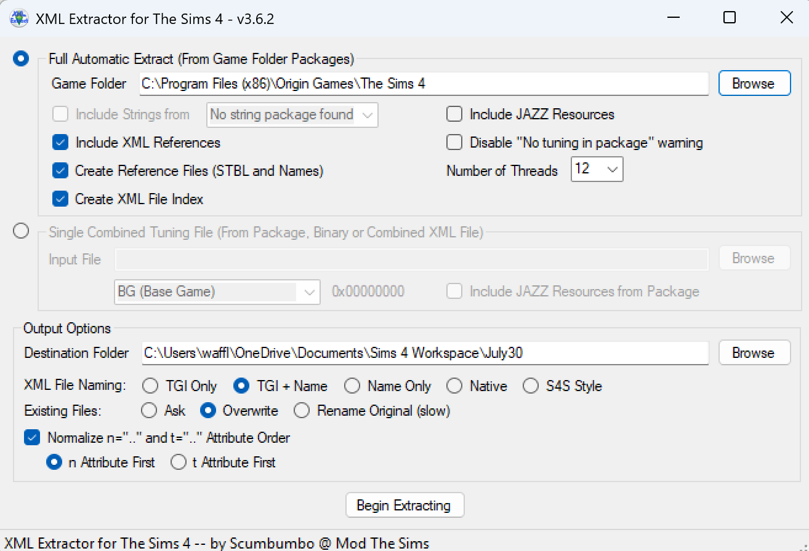

A tutorial by Waffle

[Scumbumbo's XML Extractor](https://scumbumbomods.com/xml-extractor/) can be used to bulk extract all game XMLs at once to organized folders, which can then be navigated with the very powerful ***[XML File Finder](../../../../tutorials/xml-file-finder/)***, which is included in the download.

XML Extractor will extract the XMLs as .xml files which can simply be opened in a text editor. These files can also be opened directly in [Lot 51's Tdesc Builder](https://tdesc.lot51.cc/) for editing.

A common use of the XML Extractor is to keep older versions of tuning around for comparison's sake after patches. If you extract the tuning after each patch, you can keep a folder of the previous tunings and a folder of the current tunings to easily compare them in a program such as ***[WinMerge, which you can find a tutorial for here](../../../../tutorials/winmerge/).***

## Features Explanation

XML Extractor is simple to use, but has a variety of options you may find confusing. 

Under "Full Automatic Extract", simply direct the program to your game's install folder (Usually C:\\Program Files (x86)\\Origin Games\\The Sims 4 on Windows). Whichever folder contains the game's TS4.exe is correct.

Ticking "Include Strings" will include the String Table files alongside the tuning XMLs. This is entirely optional but there is no harm in having them.

Ticking "Include XML References" will include the XMLs themselves. You want this checked if you're reading this tutorial.

Ticking "Create Reference Files" will create a simple text file that lists all the tuning and string tables, alongside their IDs, for quick reference purposes. This is also optional.

Ticking "Create XML File Index" is critical for using Xml File Finder, so be sure to tick it.

The options on the right can be safely ignored. Include JAZZ Resources is for animation work. Disabling "No tuning in package" warning will prevent the program from alerting you that one of the game files it's trying to read doesn't have anything in it. Tick this to automatically ignore that error. Number of Threads is how much strain you want to put on your CPU for the extraction process. Leave this alone if you don't know what to do with it.

 

At the bottom under "Output Options" you'll select a destination folder. Inside this folder there will be organized subfolders, so use a logical location like your mod workspace, if you have one, and give the folder a name that tells you what patch these files were for, if you plan on keeping several patches worth of copies.

### The XML File Naming section has 5 options:

**TGI Only-** Files will be named with only their Type, Group, and Instance as the filename. This is not recommended as you cannot identify the file by the filename.

**TGI + Name-** Files will be named with their Type, Group, Instance, and Tuning Name. This is an all-around option that tells you everything you need to know, and can be searched for easily by TGI. This option is recommended.

**Native-** Don't even bother with this one. 

**Resource Name-** Saves files with only the tuning name. Good option for readability but not as informative as TGI + Name.

**S4S Style-** Tunings are extracted with the same name formatting as those extracted via Sims 4 Studio. Useful if you intend on using Sims 4 Studio extraction alongside this method at any point.

I recommend TGI + Name as it is the most informative option.

 

 

The "Existing Files" option decides how the program handles replacing files if you extract to an existing folder. It is self explanatory.

Ticking "Normalize n= and t= Attibute Order" allows you to swap which attribute appears first in the filenames. You can leave this defaulted.

How To Use
---

For basic usage, select the following options:

- Include XML References
- Create Reference Files
- Create XML File Index
- XML File Naming: TGI + Name

Select your game folder, and create and select a Destination folder. Press Begin Extracting and give it time. It'll take a while if you have all packs. The bottom of the program will tell you what it's doing and how far along the process is. When it's complete, you're done! 

 

Now you can use this tuning alongside ***[XML File Finder](../../../../tutorials/xml-file-finder/)*** to easily find connections between tuning files, to diagnose bugs, find out how something works, copy how EA does things for your own mods, and much more.

---

Originally written by [Waffle](https://www.patreon.com/c/waffle_mix_ins/) for this site.